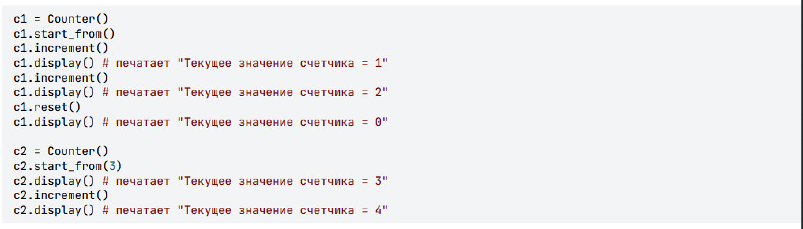
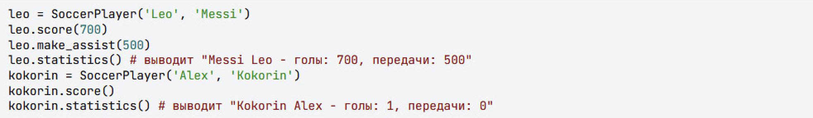
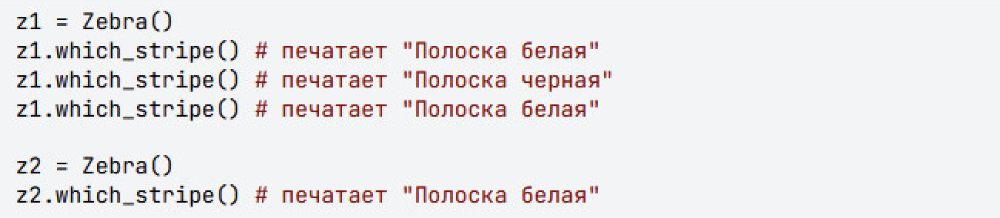
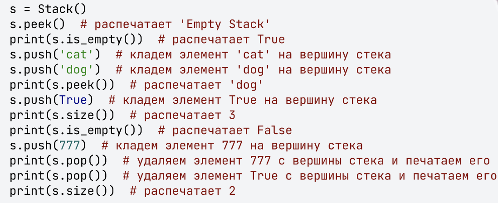
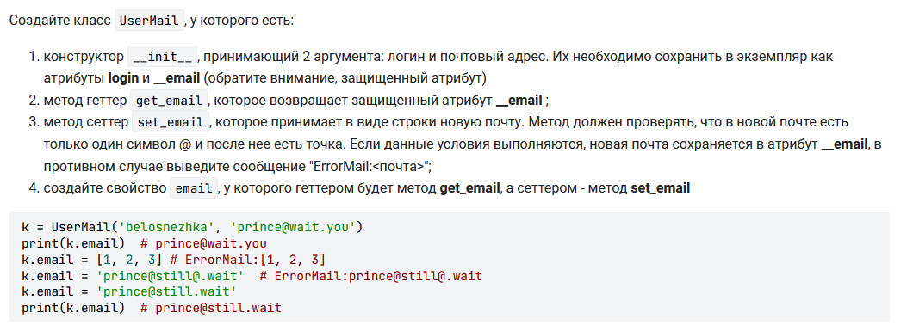
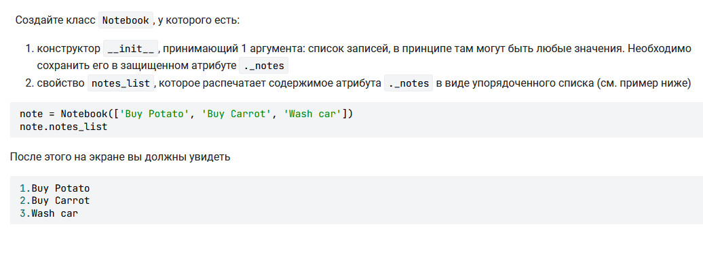
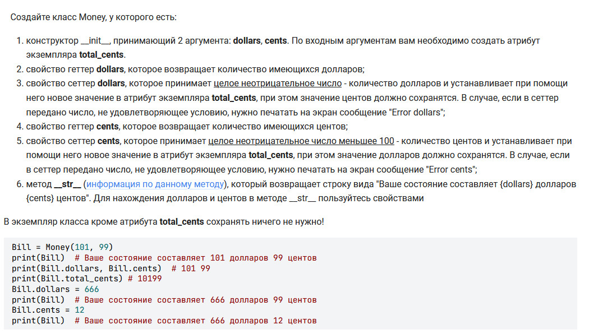

# [Tasks 1](tasks_1.py)
1. Класс **Counter**, экземпляры которого будут подсчитывать внутри себя значения.

    Пример работы с классом Counter

2. Класс Point, который находит расстояние между двумя точками по теореме Пифагора.

# [Tasks 2](tasks_2.py)

1. Класс SoccerPlayer считает статистику. 
2. Класс Zebra, внутри которого есть метод **which_stripe**, который поочередно печатать фразы "Полоска белая",
"Полоска черная", начиная именно с фразы "Полоска белая".

# [Task 3](task_3.py)
Класс Stack реализует (stack) - упорядоченную коллекцию элементов организованная по принципу LIFO(
last in - first out, "последним пришел - первый вышел")

# [Task 4](task_4.py)

# [Tasks 5](tasks_5.py)
1. Notebook

2. Money

# Vector
Сложение и умножение векторов [vector.py](vector.py)

